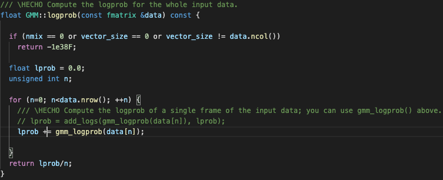

PAV - P4: reconocimiento y verificación del locutor
===================================================

Obtenga su copia del repositorio de la práctica accediendo a [Práctica 4](https://github.com/albino-pav/P4)
y pulsando sobre el botón `Fork` situado en la esquina superior derecha. A continuación, siga las
instrucciones de la [Práctica 2](https://github.com/albino-pav/P2) para crear una rama con el apellido de
los integrantes del grupo de prácticas, dar de alta al resto de integrantes como colaboradores del proyecto
y crear la copias locales del repositorio.

También debe descomprimir, en el directorio `PAV/P4`, el fichero [db_8mu.tgz](https://atenea.upc.edu/pluginfile.php/3145524/mod_assign/introattachment/0/spk_8mu.tgz?forcedownload=1)
con la base de datos oral que se utilizará en la parte experimental de la práctica.

Como entrega deberá realizar un *pull request* con el contenido de su copia del repositorio. Recuerde
que los ficheros entregados deberán estar en condiciones de ser ejecutados con sólo ejecutar:

~~~~~~~~~~~~~~~~~~~~~~~~~~~~~~~~~~~~~~~~~~~~~~~~~~~~~.sh
  make release
  run_spkid mfcc train test classerr verify verifyerr
~~~~~~~~~~~~~~~~~~~~~~~~~~~~~~~~~~~~~~~~~~~~~~~~~~~~~

Recuerde que, además de los trabajos indicados en esta parte básica, también deberá realizar un proyecto
de ampliación, del cual deberá subir una memoria explicativa a Atenea y los ficheros correspondientes al
repositorio de la práctica.

A modo de memoria de la parte básica, complete, en este mismo documento y usando el formato *markdown*, los
ejercicios indicados.

## Ejercicios.

### SPTK, Sox y los scripts de extracción de características.

- Analice el script `wav2lp.sh` y explique la misión de los distintos comandos, y sus opciones, involucrados
  en el *pipeline* principal (`sox`, `$X2X`, `$FRAME`, `$WINDOW` y `$LPC`).
  
  **` Sox: permite generar una señal del formato adecuado a partir de una señal con otro formato. Por ejemplo, permite conviertir la señal de entrada a reales en coma flotante de 32 bits sin cabecera. `**
  
    

  
  **` x2x: programa de SPTK que permite la conversión entre distintos formatos de datos.`**
  
  
 
  **` Frame: permite dividir la señal de entrada en tramas de 200 muestras (25ms) con despalzamiento de la ventana de 40 muestras (5ms) (fm = 8kHz) utilizando las siguientes medidas en este caso: (sptk frame -l 200 -p 40) `**
 
  
  
  **` Window: cada trama es multiplicada por la ventana de Blackman (la duración es de 200 muestras). (sptk window -l 200) `**
  
   
  
  **` LPC_order: calcula los primeros coeficientes de predicción lineal. `**
  
   

  
  
  
  
  

- Explique el procedimiento seguido para obtener un fichero de formato *fmatrix* a partir de los ficheros
  de salida de SPTK (líneas 41 a 47 del script `wav2lp.sh`).
  
  **`En las líneas 41 a 43, que podemos ver en la siguiente imagen, el procedimiento a seguir es, primero mediante el comando sox pasar la señal .wav a unsigned int sin ninguna cabexera o fermato adicional. Después, mediante el comando X2X hacemos la conversión de datos de short a float. El siguiente paso es dividir la señal de entrada en tramas de 240 muestras (30 ms) con un desplazamiento de la ventana de 80 muestras (10 ms) con el comando frame de la libreria. Después aplicamos la ventana de Blackman con 240 muestras tanto de entrada como de salida. Y por último, calcula los 'lpc_order' primeros coeficientes de predicción lineal pasados por el parametro -m y donde el -l es el tamaño del frame. Para acabar redireccionamos la salida un fichero llamado $base.lp`**
  

**`En las lineas 45 a 47, que podemos ver en la siguiente, primero calculamos el numero de columnas sumando uno al orden del predictorya que en el primer elemento del vector se almacena la ganancia de predicción. En esta matriz los datos se almacenarán de la siguiente manera: en cada fila para cada trama de la señal y cada columna para cada uno de los coeficientes con los que se parametriza la trama. Para calcular este último, el número de filas, es un poco más complejo que el de columnas ya que depende de la longitud de la señal, la longitud y desplazamiento de la ventana. Primero de todo con el comando sox convertimos los datos de tipo float a ascii y después contamos el número de líneas con el comando wc -l.  `**
  

  * ¿Por qué es conveniente usar este formato (u otro parecido)?
  
  **` La matriz se usa para poder identificar correctamente los coeficientes por trama. Usamos el fichero ffmatrix, que representa el número de filas y columnas seguidas de los datos, donde calcularemos el número de filas y columnas mediante algunas operaciones que se explican en el manual de la práctica (para las columnas es simplemente el número de coeficientes + 1, pero para las filas es un poco más complicado).  `**
  * ¿Por qué es conveniente usar este formato (u otro parecido)?

- Escriba el *pipeline* principal usado para calcular los coeficientes cepstrales de predicción lineal
  (LPCC) en su fichero <code>scripts/wav2lpcc.sh</code>:
  
  **`Buscando la información teórica en el manual:`**
  
  
  
  
  **`La pipeline principal es:`**
  
  
  
  **`Donde representa que en el apartado de LPCC el -l es 'frame length del input', y -m es el orden del LPCC.`**

  **`Teniendo en cuenta que pasamos los sigueintes datos como parametros:`**
  
  
  
  **`Y añadimos la función en run_spkid:`**

  

- Escriba el *pipeline* principal usado para calcular los coeficientes cepstrales en escala Mel (MFCC) en
  su fichero <code>scripts/wav2mfcc.sh</code>:

  **`Buscando la información teórica en el manual:`**
  
  
  
  **`La pipeline principal es:`**
  
  
  
  **`Donde representa que en el apartado de MFCC el -l es 'frame length del input', y -m es el orden del MFCC.`**

  **`Teniendo en cuenta que pasamos los sigueintes datos como parametros:`**
  
  
  
  **`Y añadimos la función en run_spkid:`**

  

### Extracción de características.

- Inserte una imagen mostrando la dependencia entre los coeficientes 2 y 3 de las tres parametrizaciones
  para una señal de prueba.

  **`LP:`**

    

  **`LPCC:`**

    

  **`MFCC:`**

    

  + ¿Cuál de ellas le parece que contiene más información?
  
    **`Que dos parámetros estén correlados quiere decir que sabiendo uno podemos imaginarnos qué valor tiene el otro. Así pues, el segundo parámetro no añade información al primero. En esta práctica nos referimos siempre a correlación lineal, aunque no tiene porque ser así. Si los dos parámetros están incorrelados, cualquier valor del segundo es posible para cualquier valor del primero. No podemos intuir qué valor tendrá, por tanto podemos considerar que proporcionan el doble de información que uno sólo. Es lo que ocurre con el MFCC en las gráficas.`**

- Usando el programa <code>pearson</code>, obtenga los coeficientes de correlación normalizada entre los
  parámetros 2 y 3, y rellene la tabla siguiente con los valores obtenidos.

  

  |                        |    LP   |  LPCC  |   MFCC  |
  |------------------------|:-------:|:------:|:-------:|
  | &rho;x[2,3] |-0.872284|0.116522|0.0277646|
  
  + Compare los resultados de <code>pearson</code> con los obtenidos gráficamente.
  
- Según la teoría, ¿qué parámetros considera adecuados para el cálculo de los coeficientes LPCC y MFCC?

  **`Sabemos que el objetivo es representar la señal de voz con el mismo número de parámetros posibles, sin perder información relevante. Puede ser que las formas de onda no se parezcan para nada a pesar que pronunciemos la misma letra. Esto es debido a que hay variabilidad. Mejor tendré entonces que comparar con las envolventes espectrales (caso LPCC). `**
  
    **`Si hacemos el LPC vamos a 1kHz por formante + 2 de propina (aproximadamente). Por lo tanto, el LPCC tendrá (3/2)p. Para nuestro caso, teníamos que P = 8, por lo tanto, será de 12 coeficientes. El cepstrum es una representación eficiente de la señal del habla. Parece tener una buena representación de la envolvente espectral con muy pocas muestras.`**

    **`Para el caso del MFCC: En procesado de señal, el MFC (Mel Frequency Cepstrum) es la representación del término corto del espectro de potencia de un sonido, basado en una DCT (discrete cosine transform - linear) de una potencia espectral logarítmica de una escala de frecuencia no lineal. Se usan los primeros Q = 13 coeficientes.`**
    
    

    **`Observación: Los MFCC dan una información mejor que la FFT de la trama ya que proporcionan información de la envolvente espectral, descartando la información relativa al pitch que no se usa en reconocimiento, están correlados con el oído por tener un log en su cálculo, y es un número pequeño. Veremos, más adelante que para mejorar las prestaciones del reconocedor, una opción es añadir su derivada y su segunda derivada.`**
    

### Entrenamiento y visualización de los GMM.

Complete el código necesario para entrenar modelos GMM.

- Inserte una gráfica que muestre la función de densidad de probabilidad modelada por el GMM de un locutor
  para sus dos primeros coeficientes de MFCC.
  
  **`Aquí podemos ver el código modificado para calcular el logaritmo de la probabilidad de las GMM's:`**
  
  
  
  **`Aquí podemos ver el código del algoritmo expectation - maximization:`**
  
  

  **`Aquí podemos ver el código de las incializaciones:`**
  
  

  **`Respecto al dibujo que veremos a continuación, lo hemos hecho con 4 GMM’s, hemos modificado las características en la línea 140 de run_spikd.sh para generar modelos con 4 gausianas. Aquí podemos ver el código y luego dibujo :`**
  

  **`Aquí podemos ver como se visualiza si ponemos la población:`**
  

- Inserte una gráfica que permita comparar los modelos y poblaciones de dos locutores distintos (la gŕafica
  de la página 20 del enunciado puede servirle de referencia del resultado deseado). Analice la capacidad
  del modelado GMM para diferenciar las señales de uno y otro.

### Reconocimiento del locutor.

Complete el código necesario para realizar reconociminto del locutor y optimice sus parámetros.

- Inserte una tabla con la tasa de error obtenida en el reconocimiento de los locutores de la base de datos
  SPEECON usando su mejor sistema de reconocimiento para los parámetros LP, LPCC y MFCC.

### Verificación del locutor.

Complete el código necesario para realizar verificación del locutor y optimice sus parámetros.

- Inserte una tabla con el *score* obtenido con su mejor sistema de verificación del locutor en la tarea
  de verificación de SPEECON. La tabla debe incluir el umbral óptimo, el número de falsas alarmas y de
  pérdidas, y el score obtenido usando la parametrización que mejor resultado le hubiera dado en la tarea
  de reconocimiento.
 
### Test final y trabajo de ampliación.

- Recuerde adjuntar los ficheros `class_test.log` y `verif_test.log` correspondientes a la evaluación
  *ciega* final.

- Recuerde, también, enviar a Atenea un fichero en formato zip o tgz con la memoria con el trabajo
  realizado como ampliación, así como los ficheros `class_ampl.log` y/o `verif_ampl.log`, obtenidos como
  resultado del mismo.
